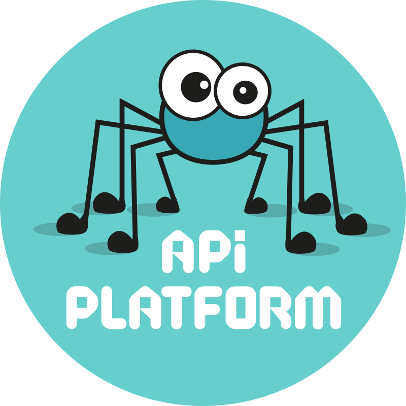

# Api-platform 3 Boilerplate

<table border="0">
 <tr>
    <td></td>
    <td></td>
    <td></td>
 </tr>
</table>

## Build project

`make start`

## Start project

`make up`

## Go to project

https://localhost/

## Mailer

http://localhost:8025/

## Create databases

`php bin/console doctrine:database:create`

`php bin/console doctrine:database:create -e test`

## Updates schema

`php bin/console doctrine:shema:update --force`

`php bin/console doctrine:shema:update --force -e test`

## Create fixtures

`php bin/console make:factory`

## Load fixtures

`php bin/console doctrine:fixtures:load`

## Run tests

`php vendor/bin/codecept run api`
